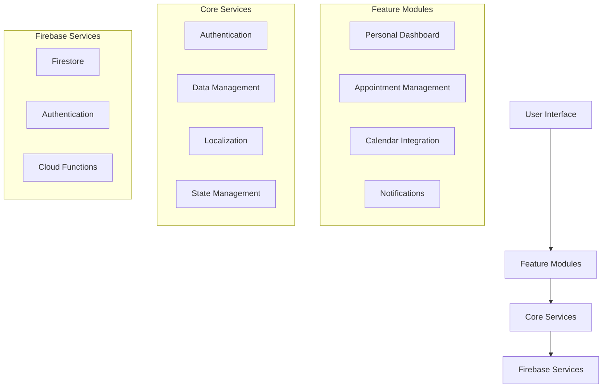

# APP-OINT Architecture Documentation

## Overview

APP-OINT is a modern appointment management system built with Flutter and Firebase, following AGENTI V2 architecture standards. The application is designed to be modular, scalable, and maintainable, with clear separation of concerns and well-defined responsibilities.

## Architecture Diagram

## Module Responsibilities

### Core Modules

| Module | Responsibility | Key Files |
|--------|---------------|-----------|
| Authentication | User authentication and session management | `lib/services/auth_service.dart` |
| Data Management | CRUD operations and data persistence | `lib/services/appointments_service.dart` |
| Localization | Multi-language support | `lib/l10n/` |
| State Management | Application state using Riverpod | `lib/providers/` |

### Feature Modules

| Module | Responsibility | Key Files |
|--------|---------------|-----------|
| Personal Dashboard | User's main interface | `lib/screens/personal_dashboard_screen.dart` |
| Appointment Management | Appointment CRUD operations | `lib/screens/appointment_edit_screen.dart` |
| Calendar Integration | External calendar sync | `lib/services/calendar_service.dart` |
| Notifications | Push notifications | `lib/services/notification_service.dart` |

## AGENTI V2 Compliance

### DIR1 Rules
- All business logic is separated from UI
- Services are abstracted behind interfaces
- State management uses Riverpod
- Localization is handled through l10n
- Firebase services are properly abstracted

### Core Principles
1. **Modularity**: Each feature is self-contained
2. **Testability**: All components are unit-testable
3. **Maintainability**: Clear separation of concerns
4. **Scalability**: Easy to add new features
5. **Security**: Proper authentication and authorization

## Future Development

### Planned Features
1. **Calendar Integration**
   - Full Google/Apple Calendar API integration
   - Recurring appointments
   - Calendar sync

2. **Authentication**
   - Facebook/Apple authentication
   - Multi-factor authentication
   - Session management

3. **Appointment Management**
   - Location picker/map integration
   - Reminder settings
   - Batch operations
   - Offline support

4. **User Experience**
   - Profile and settings screens
   - Customizable themes
   - Accessibility improvements

## Development Guidelines

1. **Code Organization**
   - Follow feature-first architecture
   - Keep UI and business logic separate
   - Use proper dependency injection

2. **Testing**
   - Write unit tests for all business logic
   - Include widget tests for UI components
   - Maintain high test coverage

3. **Documentation**
   - Document all public APIs
   - Keep architecture documentation updated
   - Include examples in documentation

4. **Performance**
   - Optimize Firebase queries
   - Implement proper caching
   - Monitor app performance

## Links

- [Flutter Documentation](https://docs.flutter.dev/)
- [Firebase Documentation](https://firebase.google.com/docs)
- [Riverpod Documentation](https://riverpod.dev/docs/getting_started)
- [AGENTI V2 Guidelines](https://github.com/agentiv2/guidelines) 